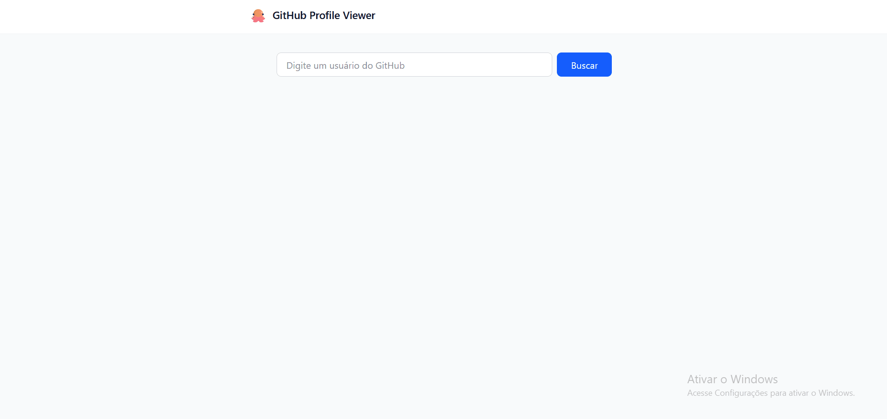

# 🔍 GitHub Profile Viewer

Aplicação web que permite buscar e visualizar perfis do GitHub de forma rápida e intuitiva. O projeto consome dados da API do GitHub e exibe informações relevantes do usuário em uma interface moderna e responsiva.

---

## 📸 Preview


  

## 📱Mobile
  

---

## 🚀 Funcionalidades

* 🔎 Buscar usuários do GitHub em tempo real
* 👤 Exibir informações do perfil:

  * Nome
  * Username
  * Bio
  * Seguidores / Seguindo
  * Repositórios públicos
* ⚡ Feedback de loading
* ❌ Tratamento de erros (usuário não encontrado)
* 📱 Design responsivo

---

## 🛠️ Tecnologias utilizadas

* ⚛️ React
* ⚡ Vite
* 🎨 Tailwind CSS
* 🌐 GitHub API

---

## 📦 Como rodar o projeto

```bash
# Clone o repositório
git clone https://github.com/1Helder/github-profile-viewer

# Entre na pasta
cd github-profile-viewer

# Instale as dependências
npm install

# Rode o projeto
npm run dev
```

---

## 🌐 Deploy

Acesse👉: https://github-profile-viewer-eight-nu.vercel.app/
 

---

## 📚 Aprendizados

Este projeto foi desenvolvido para praticar:

* Consumo de APIs
* Gerenciamento de estado no React
* Componentização
* Estilização com Tailwind CSS
* Boas práticas de UI/UX

---
